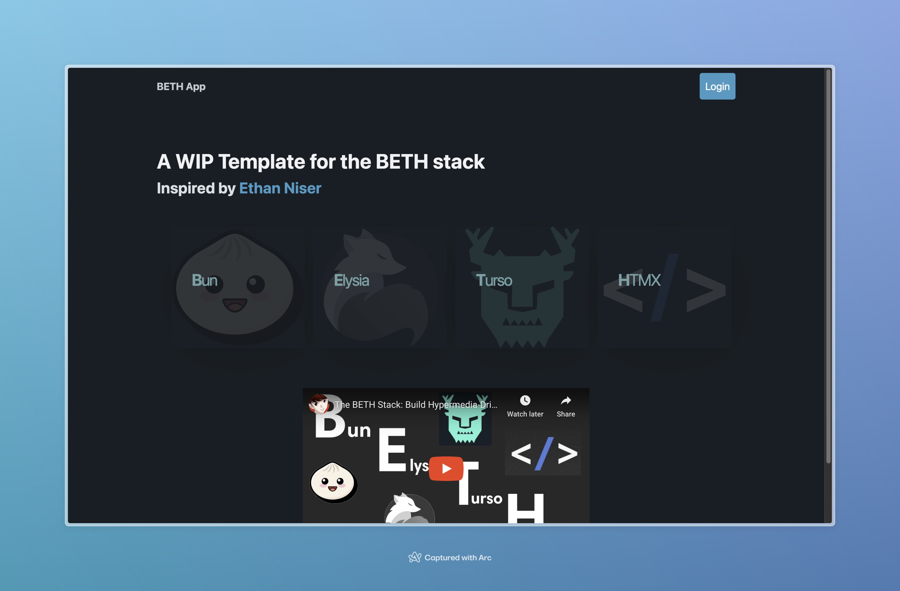

# BETH App

Hypermedia-driven architecture for building web apps inspired by [Ethan Niser](https://github.com/ethanniser).

## Built with the BETH Stack

  🥟   B - Runtime: bun \
  🦊   E - Server: elysia \
  🐬   T - Database: turso (sqlite) \
  🐴   H - HTML: htmx



### Development

To start the development server run:

```bash
bun dev
```

Open <http://localhost:3000/> with your browser to see the frontend.

### TODO

Lots and lots ...
